# 🎮 Reglas del Juego TeraDeck

## 📋 Información General

**TeraDeck** es un juego de cartas estratégico para 2-6 jugadores donde debes completar tu proyecto tecnológico mientras saboteas a tus rivales.

### 🎯 Objetivo
Sé el primero en reunir **4 módulos estables** en tu área de juego para completar tu proyecto.

### ⏱️ Duración
Aproximadamente 20 minutos por partida.

### 🎴 Contenido del Mazo

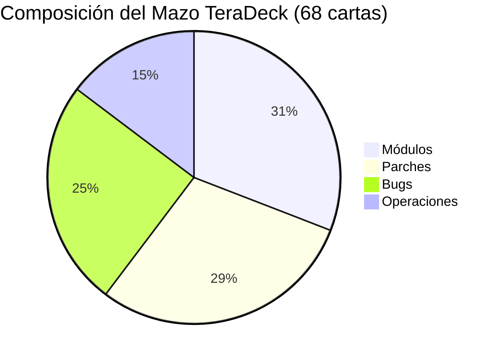

#### Módulos (21 cartas)
- 🔵 Backend: 5 cartas
- 🟡 Frontend: 5 cartas  
- 🔴 Mobile: 5 cartas
- 🟢 Data Science: 5 cartas
- 🌈 Multicolor: 1 carta

#### Bugs (17 cartas)
- 🔵 Backend: 4 cartas
- 🟡 Frontend: 4 cartas
- 🔴 Mobile: 4 cartas
- 🟢 Data Science: 4 cartas
- 🌈 Multicolor: 1 carta

#### Parches (20 cartas)
- 🔵 Backend: 4 cartas
- 🟡 Frontend: 4 cartas
- 🔴 Mobile: 4 cartas
- 🟢 Data Science: 4 cartas
- 🌈 Multicolor: 4 cartas

#### Operaciones (10 cartas)
- 🏗️ Cambio de Arquitecto: 3 cartas
- 🎯 Reclutamiento del Groso: 3 cartas
- 🎣 Phishing Interno: 2 cartas
- 🎉 Fiesta de Fin de Año: 1 carta
- 🔄 Project Swap: 1 carta

## 🚀 Preparación del Juego

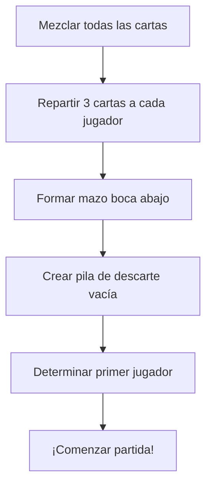

## 🎲 Secuencia de Turno

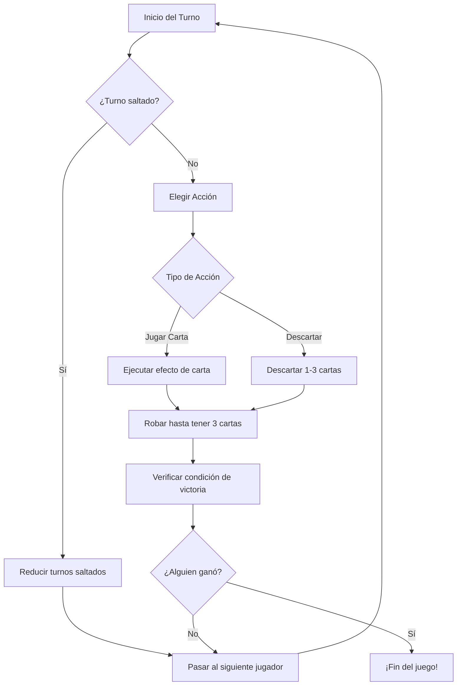

## 🏗️ Estados de los Módulos

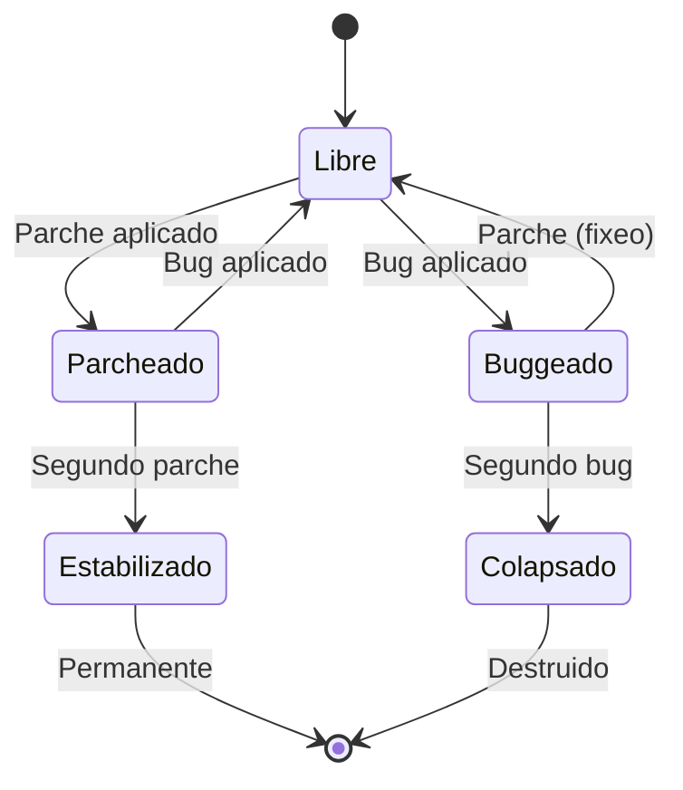

### 📊 Descripción de Estados

| Estado | Descripción | Puede Ganar |
|--------|-------------|-------------|
| 🟢 **Libre** | Sin bugs ni parches | ✅ |
| 🔴 **Buggeado** | Tiene al menos un bug | ❌ |
| 🔧 **Parcheado** | Protegido con parche | ✅ |
| 🛡️ **Estabilizado** | Protección permanente | ✅ |
| 💥 **Colapsado** | Destruido (va al descarte) | - |

## 🃏 Efectos de las Cartas

### 🏗️ Módulos

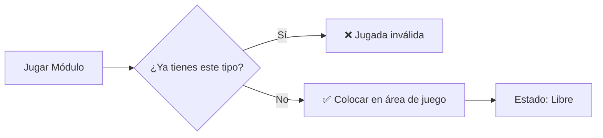

**Reglas:**
- No puedes tener dos módulos del mismo tipo
- Los módulos multicolor pueden reemplazar cualquier tipo
- Se colocan en estado "Libre"

### 🐛 Bugs

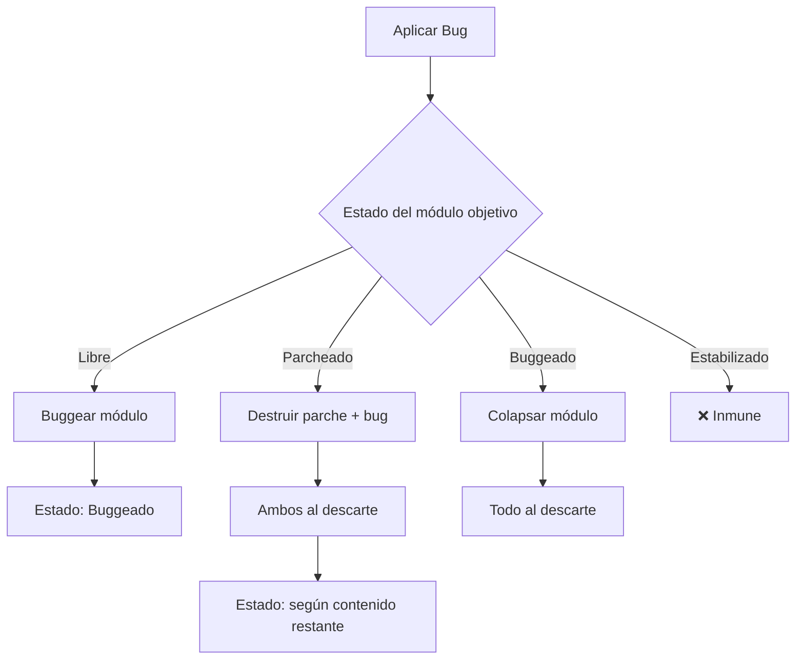

### 🔧 Parches

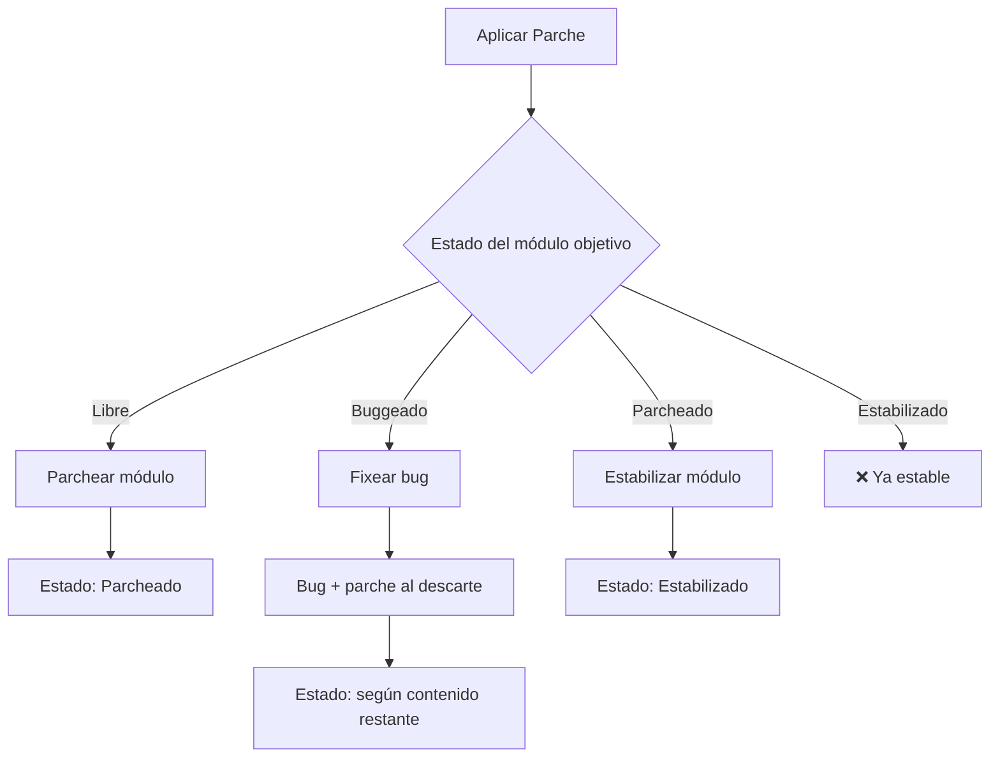

### ⚙️ Operaciones

#### 🏗️ Cambio de Arquitecto

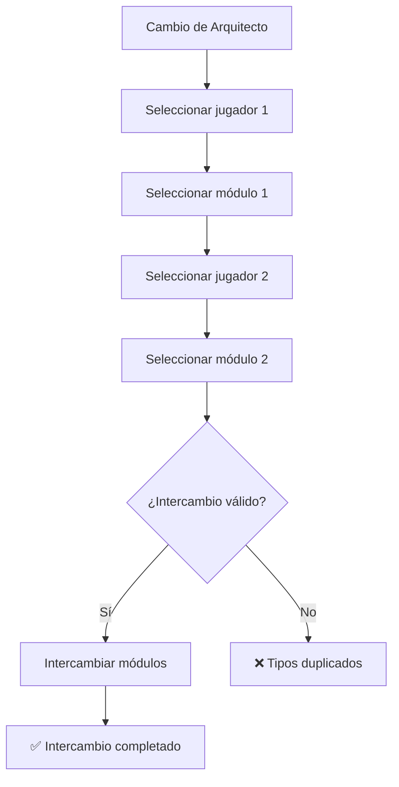

#### 🎯 Reclutamiento del Groso

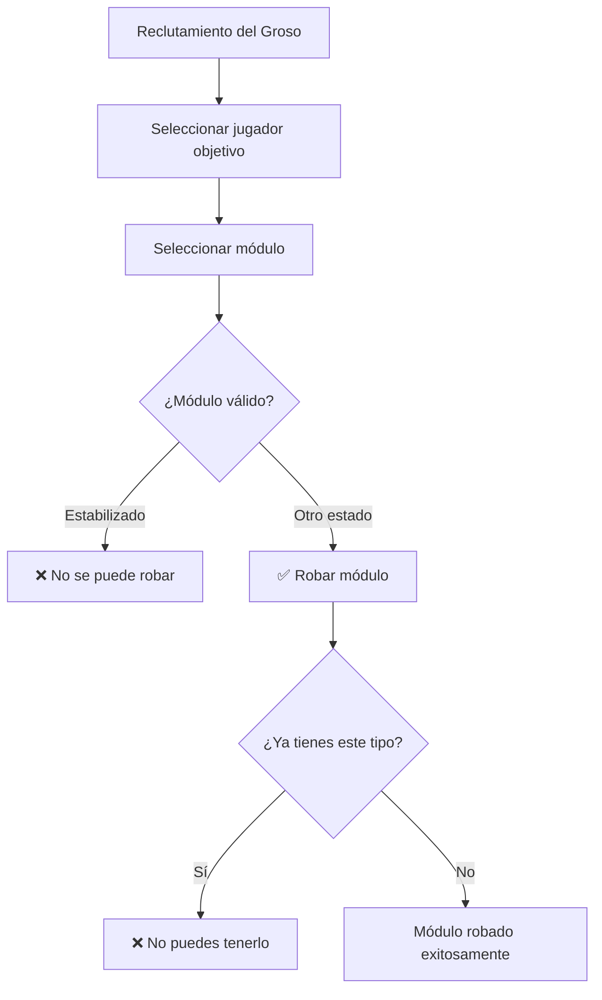

#### 🎣 Phishing Interno

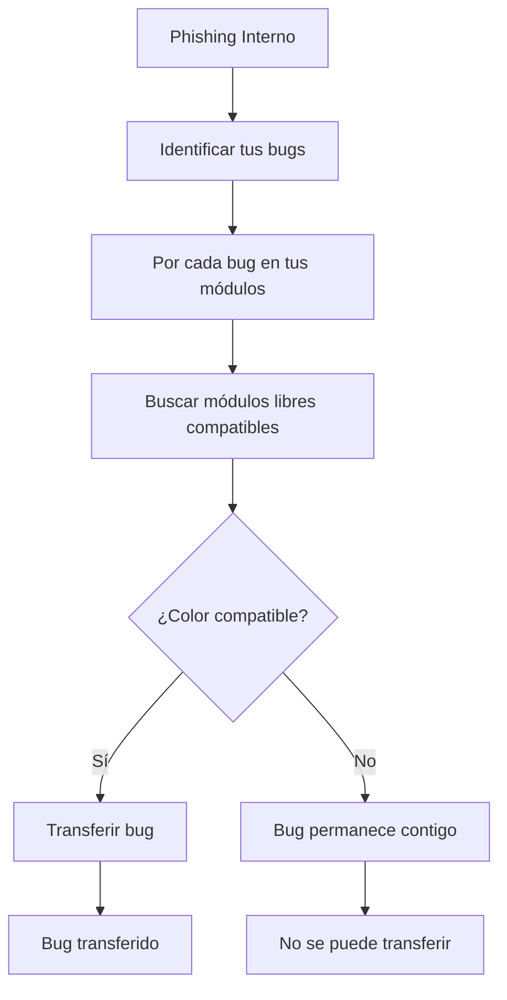

#### 🎉 Fiesta de Fin de Año

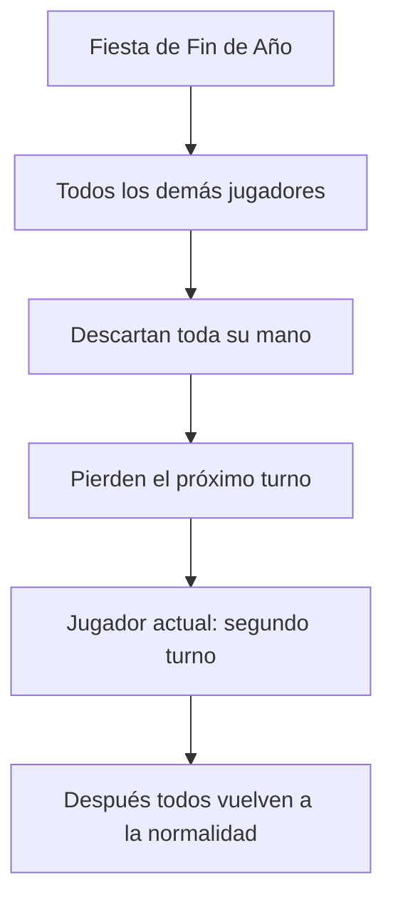

#### 🔄 Project Swap

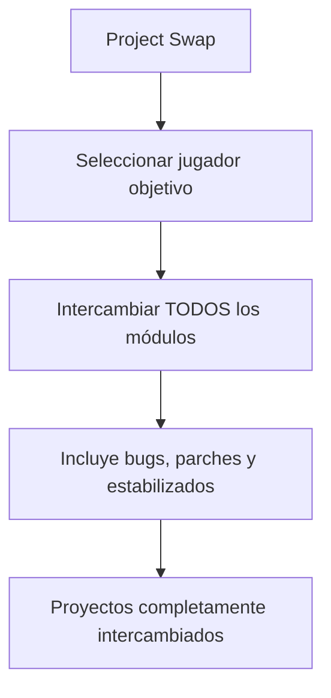

## 🌈 Reglas de Compatibilidad de Colores

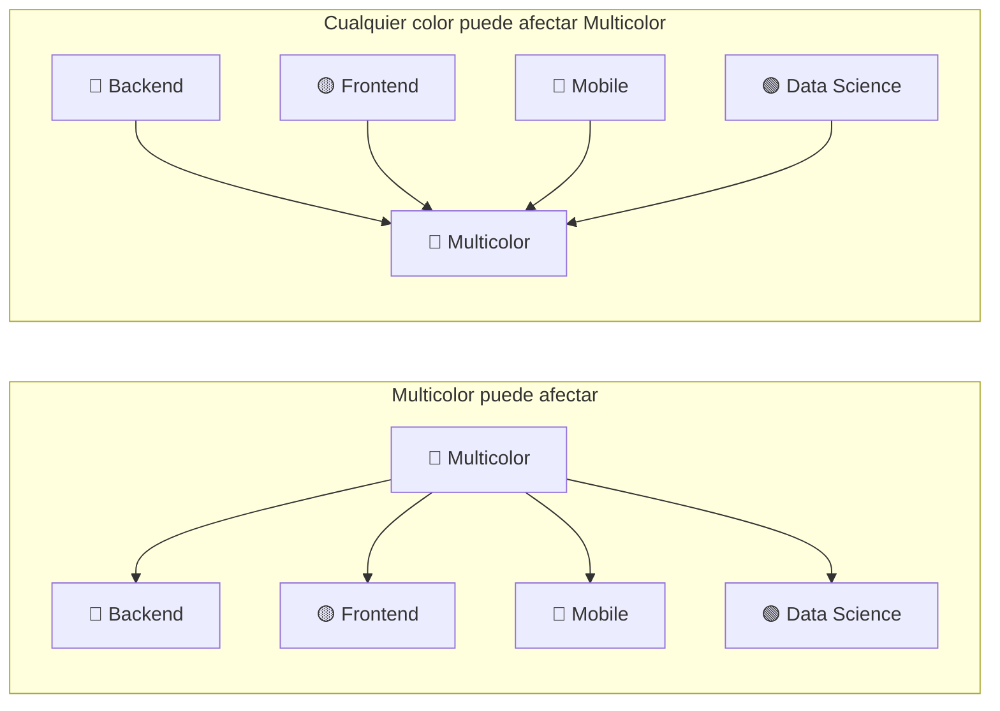

### 📋 Tabla de Compatibilidad

| Carta/Módulo | 🔵 Backend | 🟡 Frontend | 🔴 Mobile | 🟢 Data Science | 🌈 Multicolor |
|--------------|------------|-------------|-----------|-----------------|----------------|
| 🔵 Backend   | ✅         | ❌          | ❌        | ❌              | ✅             |
| 🟡 Frontend  | ❌         | ✅          | ❌        | ❌              | ✅             |
| 🔴 Mobile    | ❌         | ❌          | ✅        | ❌              | ✅             |
| 🟢 Data Science | ❌      | ❌          | ❌        | ✅              | ✅             |
| 🌈 Multicolor | ✅        | ✅          | ✅        | ✅              | ✅             |

## 🏆 Condiciones de Victoria

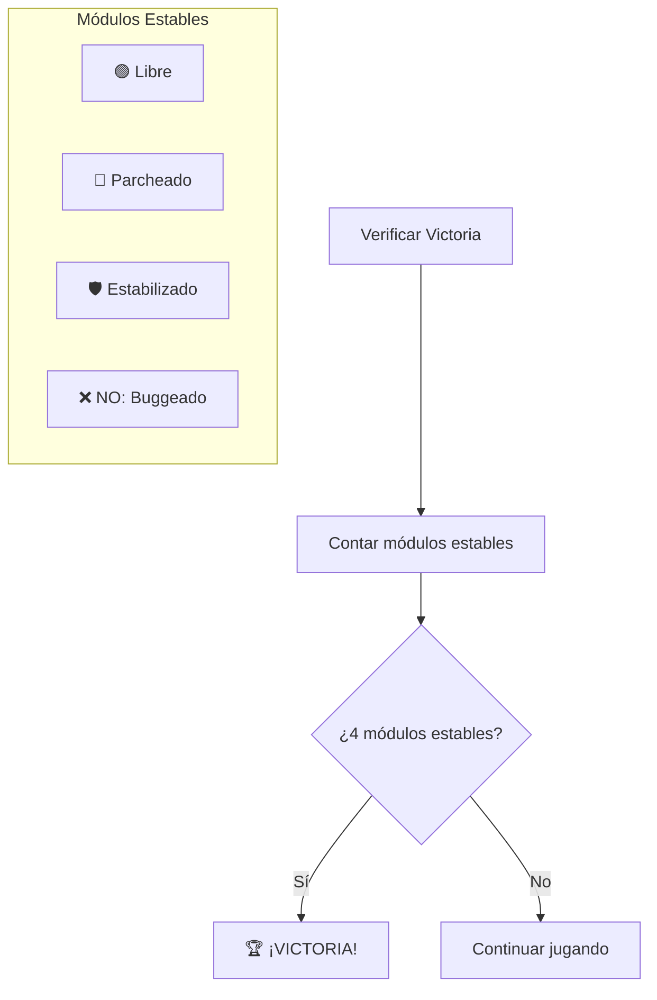

### ✅ Módulos que Cuentan para Victoria
- ✅ **Libre**: Sin bugs ni parches
- ✅ **Parcheado**: Protegido con parche
- ✅ **Estabilizado**: Protección permanente

### ❌ Módulos que NO Cuentan
- ❌ **Buggeado**: Tiene al menos un bug

## 💡 Estrategias Básicas

### 🛡️ Defensiva
- Estabiliza módulos clave temprano
- Mantén parches para emergencias
- Protege contra ataques específicos

### ⚔️ Ofensiva
- Identifica módulos críticos del rival
- Usa operaciones para disrumpir
- Coordina ataques de múltiples bugs

### 🔄 Adaptativa
- Observa las cartas descartadas
- Ajusta estrategia según el juego
- Aprovecha oportunidades de intercambio

---

**¡Que comience la batalla por el mejor proyecto!** 🚀 