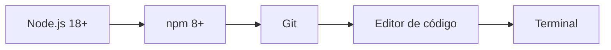
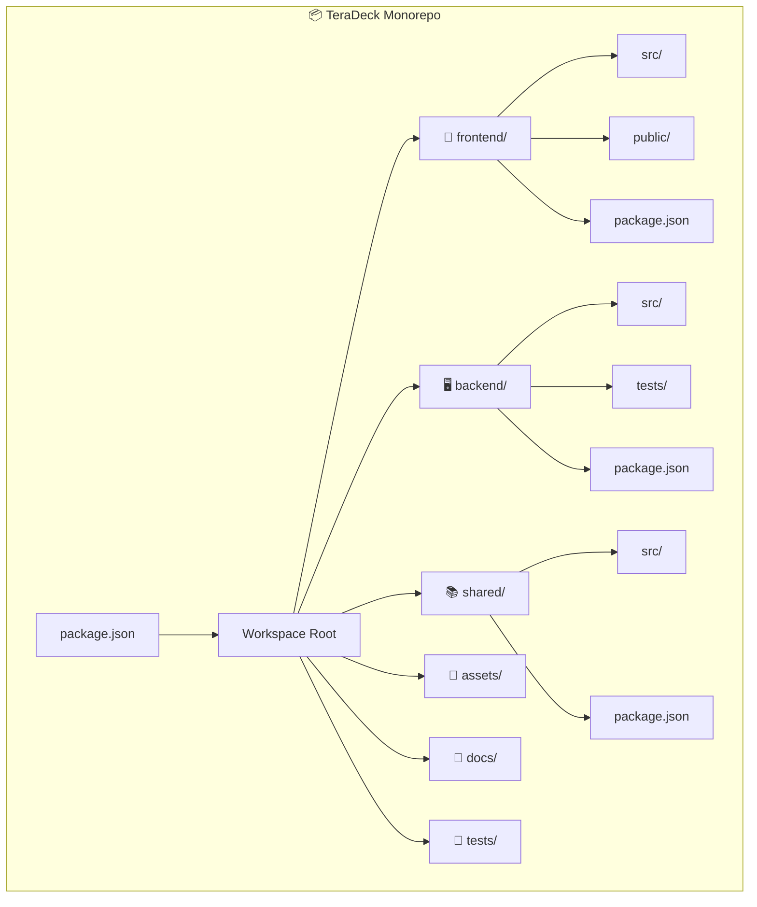
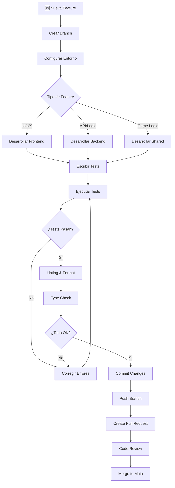
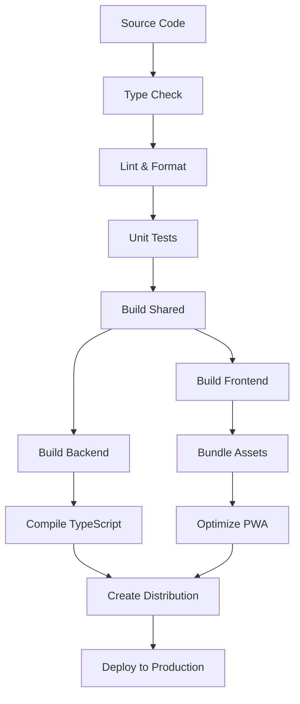

# 👨‍💻 Guía de Desarrollo TeraDeck Online

## 🚀 Configuración Inicial

### 📋 Prerrequisitos



- **Node.js**: Versión 18.0.0 o superior
- **npm**: Versión 8.0.0 o superior  
- **Git**: Para control de versiones
- **Editor**: VS Code recomendado con extensiones TypeScript

### 🛠️ Instalación del Proyecto

```bash
# Clonar el repositorio
git clone https://github.com/tu-usuario/teradeck-online.git
cd teradeck-online

# Instalar dependencias del monorepo
npm install

# Instalar dependencias de todos los workspaces
npm run install:all

# Construir módulo compartido
npm run build:shared
```

### ⚙️ Configuración del Entorno

```bash
# Copiar variables de entorno
cp backend/.env.example backend/.env
cp frontend/.env.example frontend/.env

# Editar configuraciones según necesidad
nano backend/.env
nano frontend/.env
```

## 🎯 Estructura del Proyecto



### 📁 Frontend Structure

```
frontend/
├── src/
│   ├── components/        # Componentes React
│   │   ├── common/       # Componentes reutilizables
│   │   ├── game/         # Componentes del juego
│   │   └── lobby/        # Componentes de lobby
│   ├── hooks/            # Custom hooks
│   ├── services/         # Servicios (API, Socket)
│   ├── store/            # Estado global (Zustand)
│   ├── types/            # Tipos TypeScript
│   ├── styles/           # Estilos globales
│   ├── i18n/             # Internacionalización
│   │   └── locales/      # Archivos de traducción
│   └── assets/           # Recursos estáticos
├── public/               # Archivos públicos
│   ├── manifest.json     # PWA manifest
│   └── icons/            # Iconos de la app
└── vite.config.ts        # Configuración Vite
```

### 🖥️ Backend Structure

```
backend/
├── src/
│   ├── controllers/      # Controladores Express
│   ├── services/         # Lógica de negocio
│   ├── socket/           # Handlers de WebSocket
│   ├── middleware/       # Middleware personalizado
│   └── utils/            # Utilidades
├── tests/                # Tests del backend
│   ├── unit/             # Tests unitarios
│   └── integration/      # Tests de integración
└── package.json
```

### 📚 Shared Structure

```
shared/
├── src/
│   ├── types/            # Tipos compartidos
│   ├── constants/        # Constantes del juego
│   ├── game/             # Lógica de juego
│   ├── utils/            # Utilidades compartidas
│   └── i18n/             # Traducciones compartidas
└── package.json
```

## 🔧 Comandos de Desarrollo

### 🚀 Comandos Principales

```bash
# Desarrollo completo (frontend + backend)
npm run dev

# Solo frontend
npm run dev:frontend

# Solo backend  
npm run dev:backend

# Build completo
npm run build

# Tests
npm run test

# Linting
npm run lint
npm run lint:fix

# Type checking
npm run type-check
```

### 📦 Comandos por Workspace

```bash
# Frontend
npm run dev --workspace=frontend
npm run build --workspace=frontend
npm run test --workspace=frontend

# Backend
npm run dev --workspace=backend
npm run build --workspace=backend
npm run test --workspace=backend

# Shared
npm run build --workspace=shared
npm run test --workspace=shared
```

## 🎮 Flujo de Desarrollo



## 🧪 Testing Guidelines

### 🎯 Estrategia de Testing

```mermaid
pyramid
    title Testing Pyramid
    
    "E2E Tests" : 10
    "Integration Tests" : 30  
    "Unit Tests" : 60
```

### ✅ Unit Tests

```typescript
// Ejemplo: shared/src/game/__tests__/gameLogic.test.ts
import { initializeGame, processGameAction } from '../gameLogic';
import { ActionType, CardType, ModuleColor } from '../../types/game';

describe('Game Logic', () => {
  test('should initialize game with correct state', () => {
    const players = [
      { id: 'player1', name: 'Alice', isAI: false },
      { id: 'player2', name: 'Bob', isAI: false }
    ];
    
    const gameState = initializeGame(players);
    
    expect(gameState.players).toHaveLength(2);
    expect(gameState.currentPlayerIndex).toBe(0);
    expect(gameState.deck.length).toBeGreaterThan(0);
  });
});
```

### 🔗 Integration Tests

```typescript
// Ejemplo: backend/tests/integration/gameManager.test.ts
import { GameManager } from '../../src/services/GameManager';
import { ActionType } from '@shared/types/game';

describe('GameManager Integration', () => {
  test('should handle complete game flow', async () => {
    const gameManager = new GameManager();
    const roomCode = await gameManager.createRoom('host', {});
    
    // Join players
    await gameManager.joinRoom(roomCode, 'player2');
    
    // Start game
    await gameManager.startGame(roomCode);
    
    // Play actions
    const action = {
      type: ActionType.PLAY_CARD,
      playerId: 'host',
      data: { /* card data */ }
    };
    
    const result = await gameManager.processAction(roomCode, action);
    expect(result.isValid).toBe(true);
  });
});
```

### 🎭 Frontend Component Tests

```typescript
// Ejemplo: frontend/src/components/__tests__/Card.test.tsx
import { render, screen } from '@testing-library/react';
import { Card } from '../common/Card';
import { CardType, ModuleColor } from '@shared/types/game';

describe('Card Component', () => {
  test('renders module card correctly', () => {
    const moduleCard = {
      id: 'test-card',
      type: CardType.MODULE,
      color: ModuleColor.BACKEND,
      name: { es: 'Módulo Backend', en: 'Backend Module' },
      // ... other props
    };
    
    render(<Card card={moduleCard} />);
    
    expect(screen.getByText('Módulo Backend')).toBeInTheDocument();
    expect(screen.getByTestId('card-backend')).toHaveClass('bg-blue-500');
  });
});
```

## 🎨 Convenciones de Código

### 📝 Naming Conventions

```typescript
// ✅ Buenas prácticas
// Componentes: PascalCase
const GameBoard = () => { /* ... */ };

// Hooks: camelCase con prefijo 'use'
const useGameState = () => { /* ... */ };

// Tipos: PascalCase
interface Player {
  id: string;
  name: string;
}

// Constantes: UPPER_SNAKE_CASE
const MAX_PLAYERS = 6;

// Funciones: camelCase
const calculateScore = (player: Player) => { /* ... */ };

// Archivos: kebab-case
// game-board.component.tsx
// use-game-state.hook.ts
```

### 🎯 TypeScript Guidelines

```typescript
// ✅ Usar tipos estrictos
interface StrictPlayer {
  readonly id: string;
  name: string;
  isAI: boolean;
  modules: ModuleCard[];
}

// ✅ Usar union types para estados
type GameStatus = 'waiting' | 'playing' | 'finished';

// ✅ Usar generics cuando sea apropiado
interface ApiResponse<T> {
  data: T;
  success: boolean;
  error?: string;
}

// ❌ Evitar 'any'
// const badData: any = someFunction(); // ❌
const goodData: Player = someFunction(); // ✅
```

### 🎨 React Patterns

```typescript
// ✅ Functional Components con hooks
const GameCard: React.FC<GameCardProps> = ({ card, onPlay }) => {
  const [isSelected, setIsSelected] = useState(false);
  const { t } = useTranslation();
  
  const handleClick = useCallback(() => {
    setIsSelected(true);
    onPlay(card);
  }, [card, onPlay]);
  
  return (
    <motion.div
      className="card"
      whileHover={{ scale: 1.05 }}
      onClick={handleClick}
    >
      {t(`cards.${card.type}.name`)}
    </motion.div>
  );
};

// ✅ Custom hooks para lógica reutilizable
const useGameActions = (gameState: GameState) => {
  const playCard = useCallback((card: Card, target?: Target) => {
    // Lógica para jugar carta
  }, [gameState]);
  
  const discardCards = useCallback((cards: Card[]) => {
    // Lógica para descartar
  }, []);
  
  return { playCard, discardCards };
};
```

## 🔌 WebSocket Development

### 📡 Event Patterns

```typescript
// shared/src/types/socket.ts
interface SocketEvents {
  // Cliente → Servidor
  'room:create': (data: CreateRoomData) => void;
  'room:join': (data: JoinRoomData) => void;
  'game:action': (data: GameActionData) => void;
  
  // Servidor → Cliente  
  'room:created': (data: RoomCreatedData) => void;
  'game:state-updated': (data: GameState) => void;
  'game:error': (data: ErrorData) => void;
}

// backend/src/socket/gameHandler.ts
export const handleGameEvents = (io: Server, socket: Socket) => {
  socket.on('game:action', async (data: GameActionData) => {
    try {
      const result = await gameManager.processAction(data.roomCode, data.action);
      
      if (result.isValid) {
        io.to(data.roomCode).emit('game:state-updated', result.gameState);
      } else {
        socket.emit('game:error', { message: result.errorKey });
      }
    } catch (error) {
      socket.emit('game:error', { message: 'internal-error' });
    }
  });
};
```

### 🎯 Error Handling

```typescript
// Frontend error handling
const useSocket = () => {
  const [error, setError] = useState<string | null>(null);
  
  useEffect(() => {
    socket.on('game:error', (errorData) => {
      setError(errorData.message);
      toast.error(t(`errors.${errorData.message}`));
    });
    
    socket.on('connect_error', () => {
      setError('connection-failed');
    });
    
    return () => {
      socket.off('game:error');
      socket.off('connect_error');
    };
  }, []);
  
  return { error, clearError: () => setError(null) };
};
```

## 🌍 Internationalization (i18n)

### 🗣️ Adding New Languages

```bash
# 1. Crear archivo de traducción
touch frontend/src/i18n/locales/it.json
touch shared/src/i18n/locales/it.ts

# 2. Agregar al detector de idiomas
# frontend/src/i18n/index.ts
```

```typescript
// shared/src/i18n/locales/it.ts
export const it: Translations = {
  common: {
    welcome: 'Benvenuto',
    loading: 'Caricamento...',
    // ...
  },
  cards: {
    modules: {
      backend: {
        name: 'Modulo Backend',
        description: 'Server e logica di business'
      }
      // ...
    }
  }
};
```

### 🎯 Translation Guidelines

```typescript
// ✅ Usar claves descriptivas
t('game.actions.playCard')  // ✅
t('pc')                     // ❌

// ✅ Usar interpolación para valores dinámicos
t('game.turn.current', { playerName: 'Alice' })

// ✅ Usar pluralización
t('game.cards.count', { count: 5 })
```

## 🎨 Styling Guidelines

### 🎨 TailwindCSS Patterns

```typescript
// ✅ Usar clases consistentes
const cardStyles = {
  base: 'rounded-lg shadow-md p-4 transition-all duration-200',
  colors: {
    backend: 'bg-blue-500 text-white',
    frontend: 'bg-yellow-500 text-black',
    mobile: 'bg-red-500 text-white',
    dataScience: 'bg-green-500 text-white',
    multicolor: 'bg-gradient-to-r from-blue-500 to-red-500'
  },
  states: {
    hover: 'hover:scale-105',
    disabled: 'opacity-50 cursor-not-allowed'
  }
};

// ✅ Usar custom components para estilos complejos
const Card = ({ color, disabled, children }) => (
  <div className={cn(
    cardStyles.base,
    cardStyles.colors[color],
    !disabled && cardStyles.states.hover,
    disabled && cardStyles.states.disabled
  )}>
    {children}
  </div>
);
```

### ✨ Framer Motion Patterns

```typescript
// ✅ Animaciones consistentes
const cardVariants = {
  idle: { scale: 1, y: 0 },
  hover: { scale: 1.05, y: -5 },
  dragging: { scale: 1.1, rotate: 5, zIndex: 999 },
  played: { 
    scale: 0.8, 
    y: -100, 
    opacity: 0,
    transition: { duration: 0.3 }
  }
};

const AnimatedCard = ({ card, onPlay }) => (
  <motion.div
    variants={cardVariants}
    initial="idle"
    whileHover="hover"
    whileDrag="dragging"
    animate={card.isPlayed ? "played" : "idle"}
    onAnimationComplete={() => card.isPlayed && onPlay()}
  >
    <Card card={card} />
  </motion.div>
);
```

## 🚀 Build & Deploy

### 📦 Build Process



### 🎯 Environment Variables

```bash
# Backend (.env)
NODE_ENV=production
PORT=7777
CORS_ORIGIN=https://teradeck.app
SESSION_SECRET=your-secret-key

# Frontend (.env)
VITE_API_URL=https://api.teradeck.app
VITE_SOCKET_URL=https://socket.teradeck.app
VITE_APP_VERSION=1.0.0
```

## 🤝 Contributing Guidelines

### 🔄 Git Workflow

```bash
# 1. Crear feature branch
git checkout -b feature/nueva-funcionalidad

# 2. Hacer cambios y commits
git add .
git commit -m "feat: agregar nueva funcionalidad"

# 3. Push y crear PR
git push origin feature/nueva-funcionalidad
# Crear Pull Request en GitHub
```

### 📝 Commit Conventions

```bash
# Tipos de commit
feat:     Nueva funcionalidad
fix:      Corrección de bugs
docs:     Documentación
style:    Formato de código
refactor: Refactoring
test:     Tests
chore:    Mantenimiento

# Ejemplos
git commit -m "feat: agregar sistema de IA para jugadores"
git commit -m "fix: corregir bug en validación de cartas"
git commit -m "docs: actualizar README con instrucciones"
```

### 🔍 Code Review Checklist

- [ ] ✅ Código sigue las convenciones establecidas
- [ ] 🧪 Tests incluidos y pasando
- [ ] 📝 TypeScript types correctos
- [ ] 🌍 Traducciones actualizadas (si aplica)
- [ ] 📱 Responsive design considerado
- [ ] ♿ Accesibilidad implementada
- [ ] 🚀 Performance considerado
- [ ] 🔐 Seguridad validada

---

## 🆘 Troubleshooting

### 🐛 Problemas Comunes

```bash
# Error: Module not found
npm run build:shared
npm install

# Error: Port already in use
lsof -ti:3000 | xargs kill -9
lsof -ti:7777 | xargs kill -9

# Error: TypeScript compilation
npm run type-check
npm run lint:fix

# Error: Tests failing
npm run test -- --verbose
npm run test -- --watch
```

### 📞 Obtener Ayuda

1. 📖 Revisar documentación
2. 🔍 Buscar en issues existentes
3. 💬 Crear nuevo issue con detalles
4. 🤝 Solicitar code review

---

**¡Happy Coding!** 🚀

**TeraDeck Development Team** 👨‍💻👩‍💻 