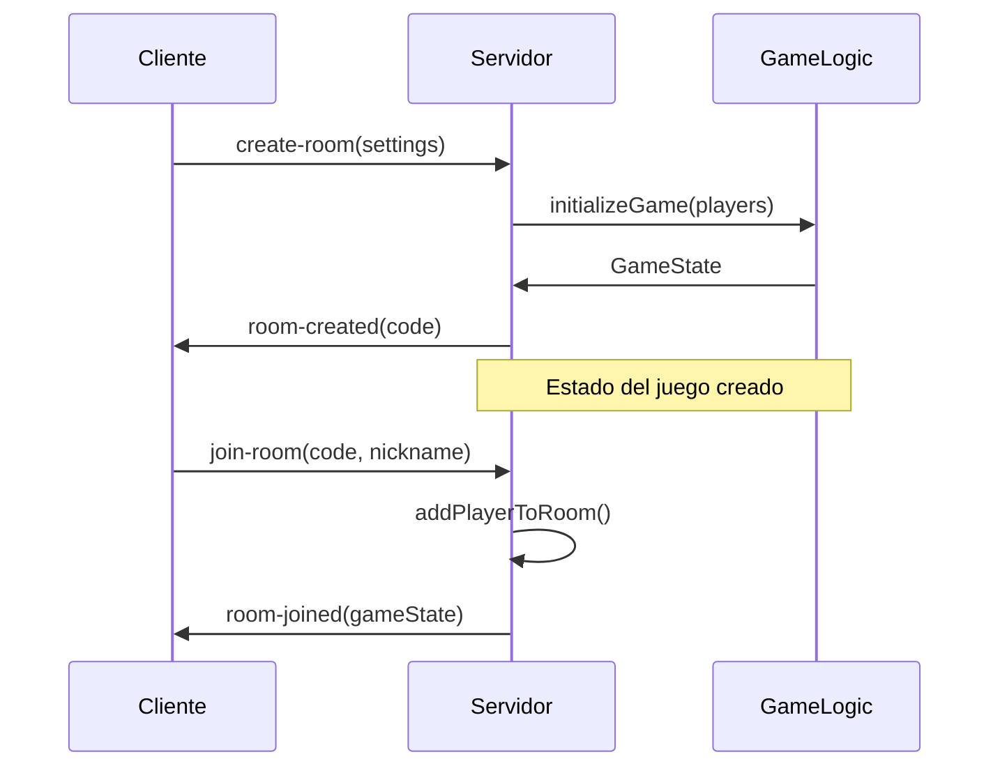
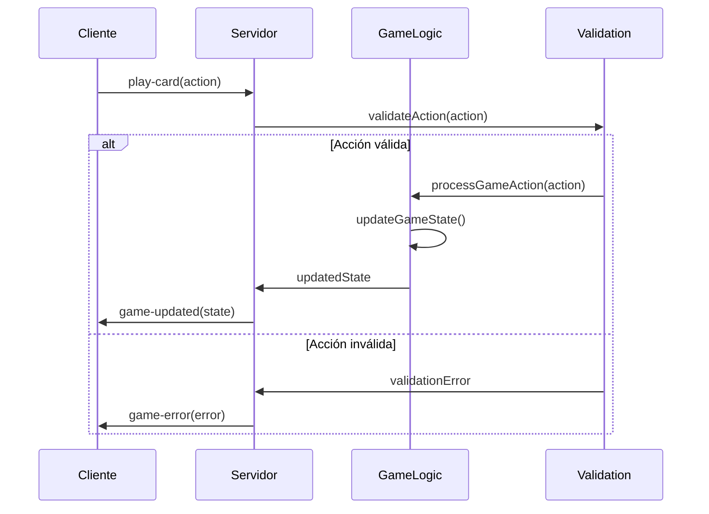

# 🏗️ Arquitectura de TeraDeck

## Visión General

TeraDeck está construido como un monorepo con arquitectura modular que separa claramente las responsabilidades entre frontend, backend y lógica compartida. La aplicación utiliza tecnologías modernas para proporcionar una experiencia de usuario fluida y un código mantenible.

## 📦 Estructura de Monorepo

```
TeraDeck/
├── 🎨 frontend/           # Cliente React (Vite + PWA)
├── 🔧 backend/            # Servidor Node.js (Express + Socket.IO)
├── 🤝 shared/             # Lógica y tipos compartidos
├── 🧪 tests/              # Tests de integración
├── 📚 docs/               # Documentación técnica
├── 🎭 assets/             # Recursos compartidos
└── ⚙️ package.json        # Configuración del workspace
```

### Ventajas del Monorepo

- **Tipos compartidos**: TypeScript garantiza consistencia entre frontend y backend
- **Reutilización de código**: Lógica del juego compartida entre cliente y servidor
- **Desarrollo sincronizado**: Cambios coordinados sin versionado complejo
- **Tooling unificado**: Linting, testing y building consistente

## 🎨 Frontend Architecture

### Stack Tecnológico

```typescript
// Stack principal
React 18         // UI Library con Concurrent Features
TypeScript       // Type Safety
Vite            // Build tool moderno y rápido
PWA             // Progressive Web App

// UI & Styling
Tailwind CSS    // Utility-first CSS framework
Framer Motion   // Animaciones declarativas
Radix UI        // Componentes accesibles primitivos

// Estado e Internacionalización
react-i18next   // Sistema de traducciones robusto
Socket.IO       // Comunicación en tiempo real
```

### Estructura de Componentes

```
src/
├── components/
│   ├── common/          # Componentes reutilizables
│   │   ├── Card.tsx     # Componente de carta con animaciones
│   │   ├── Modal.tsx    # Modal con Radix UI
│   │   └── Button.tsx   # Sistema de botones
│   ├── game/            # Componentes específicos del juego
│   │   ├── GameBoard.tsx
│   │   ├── PlayerHand.tsx
│   │   └── ModuleArea.tsx
│   └── lobby/           # Componentes del lobby
│       └── Lobby.tsx    # Pantalla principal
├── hooks/               # Custom hooks
│   ├── useTranslation.ts  # Hook de traducciones
│   ├── useGameSocket.ts   # Comunicación Socket.IO
│   └── useLocalStorage.ts # Persistencia local
├── services/            # Servicios de API
│   └── socketService.ts # Abstracción de Socket.IO
├── i18n/               # Configuración i18next
│   └── config.ts       # Setup de react-i18next
└── styles/             # Estilos Tailwind
    └── index.css       # Configuración principal
```

### Patrones de Diseño Utilizados

#### 1. Composition Pattern

```typescript
// Componentes modulares y reutilizables
function GameBoard({ children, className }: GameBoardProps) {
  return (
    <div className={`game-board ${className}`}>
      {children}
    </div>
  );
}

// Uso compositivo
<GameBoard>
  <PlayerHand />
  <ModuleArea />
  <ActionPanel />
</GameBoard>
```

#### 2. Custom Hooks Pattern

```typescript
// Lógica reutilizable encapsulada
function useGameSocket() {
  const [socket, setSocket] = useState<Socket | null>(null);
  const [gameState, setGameState] = useState<GameState | null>(null);

  // Lógica de conexión y eventos
  return { socket, gameState /* acciones */ };
}
```

#### 3. Provider Pattern (i18n)

```typescript
// Configuración global de traducciones
import './i18n/config'; // Inicializa i18next

function App() {
  return (
    <Suspense fallback={<Loading />}>
      <Router>
        <Routes>
          <Route path="/" element={<Lobby />} />
        </Routes>
      </Router>
    </Suspense>
  );
}
```

## 🔧 Backend Architecture

### Stack Tecnológico

```typescript
Node.js; // Runtime JavaScript del servidor
Express.js; // Framework web minimalista
Socket.IO; // WebSockets bidireccionales
TypeScript; // Type safety en el servidor
```

### Estructura del Servidor

```
src/
├── controllers/         # Controladores HTTP
│   ├── gameController.ts
│   └── roomController.ts
├── services/           # Lógica de negocio
│   ├── gameService.ts  # Manejo del estado del juego
│   ├── roomService.ts  # Gestión de salas
│   └── aiService.ts    # Lógica de IA
├── socket/             # Eventos Socket.IO
│   ├── gameEvents.ts   # Eventos del juego
│   ├── roomEvents.ts   # Eventos de salas
│   └── index.ts        # Configuración principal
├── middleware/         # Middlewares Express
│   ├── cors.ts
│   ├── validation.ts
│   └── auth.ts
└── utils/              # Utilidades del servidor
    └── logger.ts
```

### Event-Driven Architecture

```typescript
// Estructura de eventos Socket.IO
interface GameEvents {
  // Cliente -> Servidor
  'create-room': (settings: RoomSettings) => void;
  'join-room': (code: string, nickname: string) => void;
  'play-card': (action: PlayCardAction) => void;
  'discard-cards': (action: DiscardAction) => void;

  // Servidor -> Cliente
  'room-created': (code: string) => void;
  'room-joined': (gameState: GameState) => void;
  'game-updated': (gameState: GameState) => void;
  'player-action': (action: GameAction) => void;
  'game-error': (error: string) => void;
}
```

### Gestión de Estado

```typescript
// Estado en memoria (escalable a Redis)
class GameManager {
  private games = new Map<string, GameState>();
  private rooms = new Map<string, Room>();

  createGame(settings: GameSettings): GameState {
    const gameState = initializeGame(settings);
    this.games.set(gameState.id, gameState);
    return gameState;
  }

  processAction(gameId: string, action: GameAction): PlayValidation {
    const game = this.games.get(gameId);
    if (!game) throw new Error('Game not found');

    return processGameAction(game, action);
  }
}
```

## 🤝 Shared Architecture

### Tipos TypeScript Compartidos

```typescript
// Tipos centralizados para consistencia
export interface GameState {
  id: string;
  status: GameStatus;
  players: Player[];
  currentPlayerIndex: number;
  turn: number;
  deck: Card[];
  discardPile: Card[];
  settings: GameSettings;
  language: Language;
  winner?: string;
}

export interface Card {
  id: string;
  type: CardType;
  color?: ModuleColor | 'multicolor';
  name: LocalizedText;
  description: LocalizedText;
}

// Enums para type safety
export enum CardType {
  MODULE = 'module',
  BUG = 'bug',
  PATCH = 'patch',
  OPERATION = 'operation',
}
```

### Lógica del Juego

```
src/
├── game/               # Motor del juego
│   ├── gameLogic.ts    # Lógica principal
│   ├── cardEffects.ts  # Efectos específicos de cartas
│   └── aiLogic.ts      # Algoritmos de IA
├── constants/          # Constantes del juego
│   └── cards.ts        # Definición de las 68 cartas
├── i18n/              # Sistema de traducciones
│   ├── index.ts        # API de traducciones
│   └── locales/        # Archivos de idioma
│       ├── es.ts       # Español
│       └── en.ts       # Inglés
├── types/             # Definiciones TypeScript
│   └── game.ts         # Tipos principales
└── utils/             # Utilidades compartidas
    └── validation.ts   # Validaciones comunes
```

### Sistema de Traducciones

```typescript
// Estructura de traducciones tipadas
export interface Translations {
  ui: {
    lobby: {
      title: string;
      createGame: string;
      joinGame: string;
      // ... más claves
    };
    game: {
      yourTurn: string;
      waiting: string;
      // ... más claves
    };
  };
  cards: {
    modules: Record<string, string>;
    bugs: Record<string, string>;
    patches: Record<string, string>;
    operations: Record<string, string>;
  };
  errors: Record<string, string>;
}

// API de traducciones
export function translate(
  language: Language,
  key: string,
  params?: Record<string, any>
): string {
  // Implementación con interpolación
}
```

## 🚀 Flujo de Datos

### 1. Inicialization Flow



### 2. Game Action Flow



### 3. Real-time Synchronization

```typescript
// Sincronización automática
socket.on('game-updated', (gameState: GameState) => {
  // Cliente actualiza UI inmediatamente
  setGameState(gameState);

  // Animaciones basadas en cambios
  if (gameState.lastAction) {
    animateLastAction(gameState.lastAction);
  }
});
```

## 🎨 Sistema de Diseño

### Tailwind CSS Configuration

```typescript
// tailwind.config.js - Configuración personalizada
export default {
  theme: {
    extend: {
      colors: {
        teradeck: {
          backend: '#2196f3',
          frontend: '#ffc107',
          mobile: '#f44336',
          'data-science': '#4caf50',
        },
      },
      animation: {
        'card-flip': 'card-flip 0.6s ease-in-out',
        shimmer: 'shimmer 2s ease-in-out infinite',
      },
    },
  },
};
```

### Component Composition

```typescript
// Sistema de componentes modulares
function Card({
  card,
  onClick,
  isPlayable = true,
  showAnimation = true
}: CardProps) {
  const MotionComponent = showAnimation ? motion.div : 'div';

  return (
    <MotionComponent
      whileHover={isPlayable ? { scale: 1.05 } : {}}
      className={`card ${getCardTypeClass(card.type)}`}
      onClick={isPlayable ? onClick : undefined}
    >
      {/* Contenido del componente */}
    </MotionComponent>
  );
}
```

## 🔌 APIs y Integraciones

### Socket.IO Events API

```typescript
// Tipado de eventos para type safety
interface ServerToClientEvents {
  'room-created': (code: string) => void;
  'room-joined': (gameState: GameState) => void;
  'game-updated': (gameState: GameState) => void;
  'player-joined': (player: Player) => void;
  'player-left': (playerId: string) => void;
  'game-error': (error: string) => void;
}

interface ClientToServerEvents {
  'create-room': (settings: RoomSettings) => void;
  'join-room': (code: string, nickname: string) => void;
  'leave-room': () => void;
  'play-card': (action: PlayCardAction) => void;
  'discard-cards': (action: DiscardAction) => void;
  'pass-turn': () => void;
}
```

### REST API (Futuro)

```typescript
// Endpoints planeados para persistencia
interface TeraDeckAPI {
  // Gestión de usuarios
  POST /api/auth/login
  POST /api/auth/register
  GET  /api/auth/profile

  // Estadísticas
  GET  /api/stats/player/:id
  GET  /api/stats/leaderboard

  // Historial
  GET  /api/games/history/:playerId
  GET  /api/games/:gameId/replay
}
```

## 🔒 Seguridad y Validación

### Validación de Acciones

```typescript
// Validación en múltiples capas
export function validatePlayCard(
  gameState: GameState,
  playerId: string,
  card: Card,
  actionData: PlayCardActionData
): PlayValidation {
  // 1. Validación básica
  if (!isPlayerTurn(gameState, playerId)) {
    return { isValid: false, errorKey: 'errors.notYourTurn' };
  }

  // 2. Validación específica por tipo de carta
  switch (card.type) {
    case CardType.BUG:
      return validateBugPlay(gameState, playerId, card, actionData);
    // ... otros tipos
  }
}
```

### Sanitización de Datos

```typescript
// Limpieza de input del usuario
function sanitizeNickname(nickname: string): string {
  return nickname
    .trim()
    .slice(0, 20)
    .replace(/[<>\"'&]/g, ''); // Prevenir XSS básico
}

function sanitizeRoomCode(code: string): string {
  return code
    .toUpperCase()
    .replace(/[^A-Z0-9]/g, '')
    .slice(0, 6);
}
```

## 📱 PWA Configuration

### Service Worker

```typescript
// Estrategia de cache para PWA
const CACHE_NAME = 'teradeck-v1';
const urlsToCache = [
  '/',
  '/static/css/main.css',
  '/static/js/main.js',
  '/manifest.json',
];

self.addEventListener('install', event => {
  event.waitUntil(
    caches.open(CACHE_NAME).then(cache => cache.addAll(urlsToCache))
  );
});
```

### Manifest

```json
{
  "name": "TeraDeck Online",
  "short_name": "TeraDeck",
  "description": "Juego de cartas estratégico para desarrolladores",
  "start_url": "/",
  "display": "standalone",
  "background_color": "#667eea",
  "theme_color": "#1976d2",
  "icons": [
    {
      "src": "/icons/icon-192x192.png",
      "sizes": "192x192",
      "type": "image/png"
    }
  ]
}
```

## 🔧 Herramientas de Desarrollo

### Build Tools

```typescript
// vite.config.ts - Configuración optimizada
export default defineConfig({
  plugins: [
    react(),
    VitePWA({
      registerType: 'autoUpdate',
      workbox: {
        globPatterns: ['**/*.{js,css,html,ico,png,svg}'],
      },
    }),
  ],
  resolve: {
    alias: {
      '@': path.resolve(__dirname, './src'),
      '@shared': path.resolve(__dirname, '../shared/src'),
    },
  },
});
```

### Linting y Formato

```json
// .eslintrc.json
{
  "extends": [
    "@typescript-eslint/recommended",
    "plugin:react/recommended",
    "plugin:react-hooks/recommended"
  ],
  "rules": {
    "@typescript-eslint/no-unused-vars": "error",
    "react/prop-types": "off"
  }
}
```

## 📊 Métricas y Monitoreo

### Performance Metrics

```typescript
// Métricas de rendimiento del juego
interface GameMetrics {
  averageActionTime: number; // Tiempo promedio por acción
  gameSessionLength: number; // Duración de partidas
  playerRetentionRate: number; // Tasa de retención
  errorRate: number; // Tasa de errores
}
```

### Logging Strategy

```typescript
// Sistema de logging estructurado
const logger = {
  info: (message: string, data?: any) => {
    console.log(`[INFO] ${new Date().toISOString()} - ${message}`, data);
  },
  error: (message: string, error?: Error) => {
    console.error(`[ERROR] ${new Date().toISOString()} - ${message}`, error);
  },
  game: (action: string, gameId: string, data?: any) => {
    console.log(`[GAME] ${gameId} - ${action}`, data);
  },
};
```

## 🚀 Escalabilidad

### Horizontal Scaling

```typescript
// Preparado para múltiples instancias
interface ScalingStrategy {
  loadBalancer: 'nginx' | 'haproxy';
  sessionStore: 'redis' | 'memcached';
  database: 'postgresql' | 'mongodb';
  cache: 'redis';
  cdn: 'cloudflare' | 'aws-cloudfront';
}
```

### State Management Evolution

```typescript
// Transición hacia persistencia
// Fase 1: En memoria (actual)
const gameState = new Map<string, GameState>();

// Fase 2: Redis para sesiones
const gameState = new RedisStore();

// Fase 3: Base de datos para historial
const gameHistory = new PostgreSQLStore();
```

---

Esta arquitectura proporciona una base sólida para el crecimiento del proyecto, manteniendo la separación de responsabilidades y facilitando el mantenimiento del código.
