# 🏗️ Arquitectura Técnica TeraDeck Online

## 📋 Visión General

TeraDeck Online es una aplicación web multijugador en tiempo real construida con una arquitectura moderna y escalable que separa responsabilidades entre frontend, backend y lógica compartida.

## 🎯 Arquitectura del Sistema

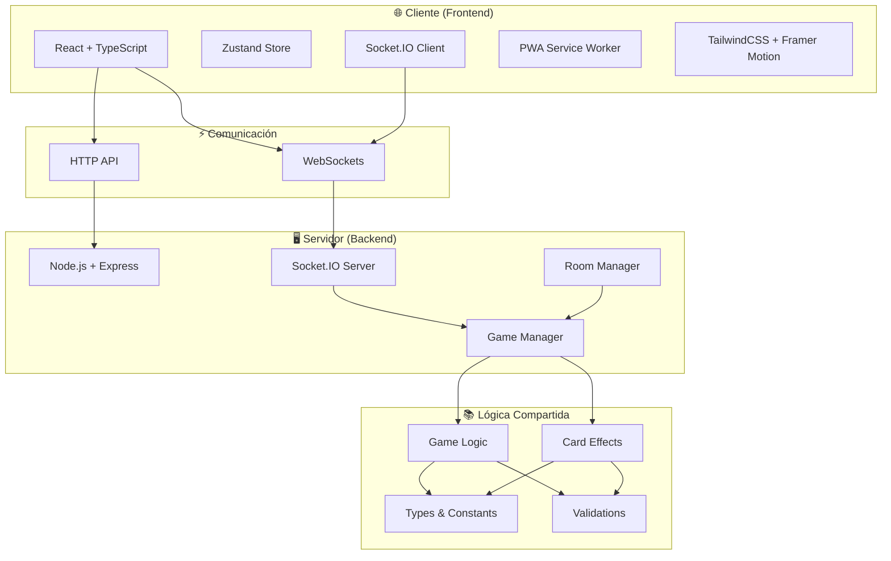

## 📁 Estructura del Monorepo

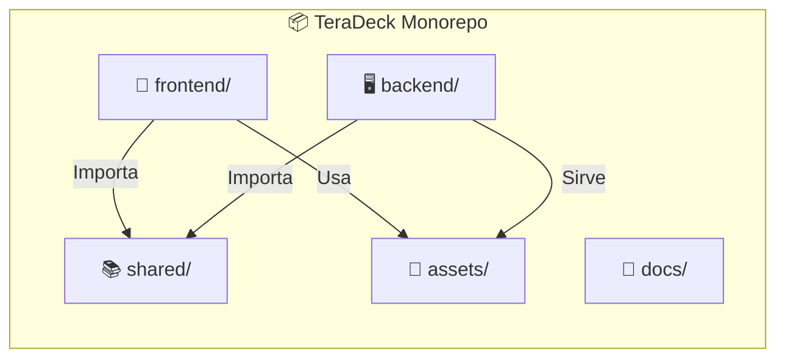

### 🎨 Frontend (React + TypeScript)

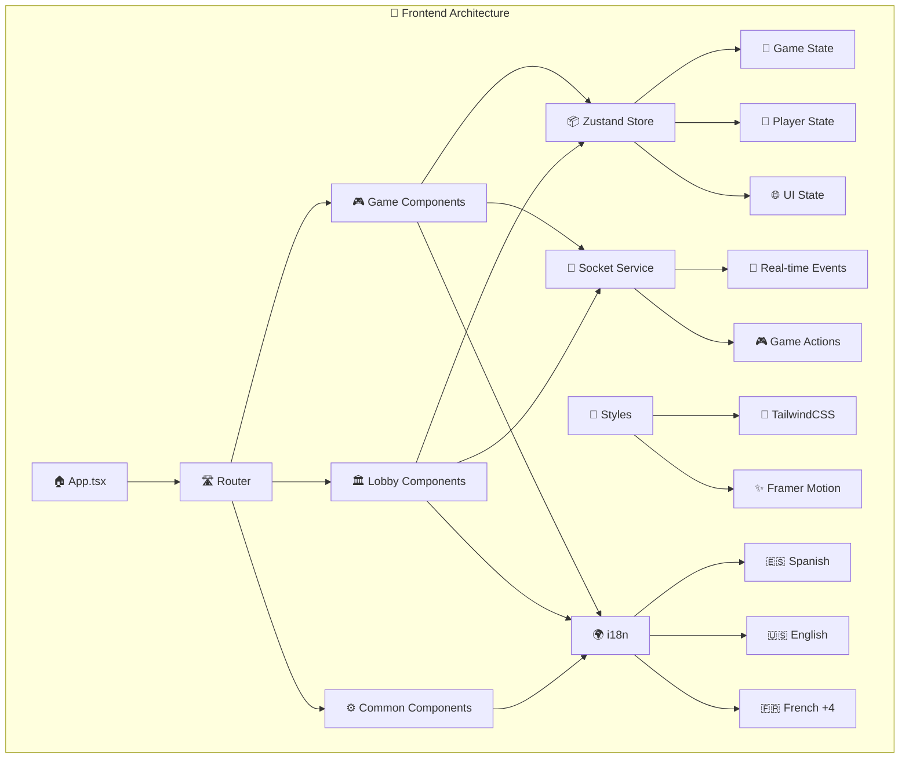

### 🖥️ Backend (Node.js + Express)

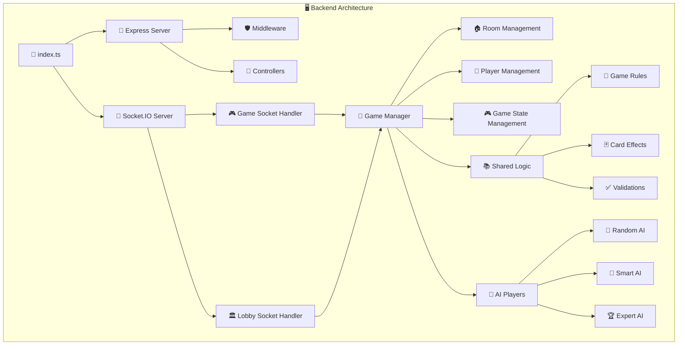

### 📚 Shared Module (Lógica Compartida)

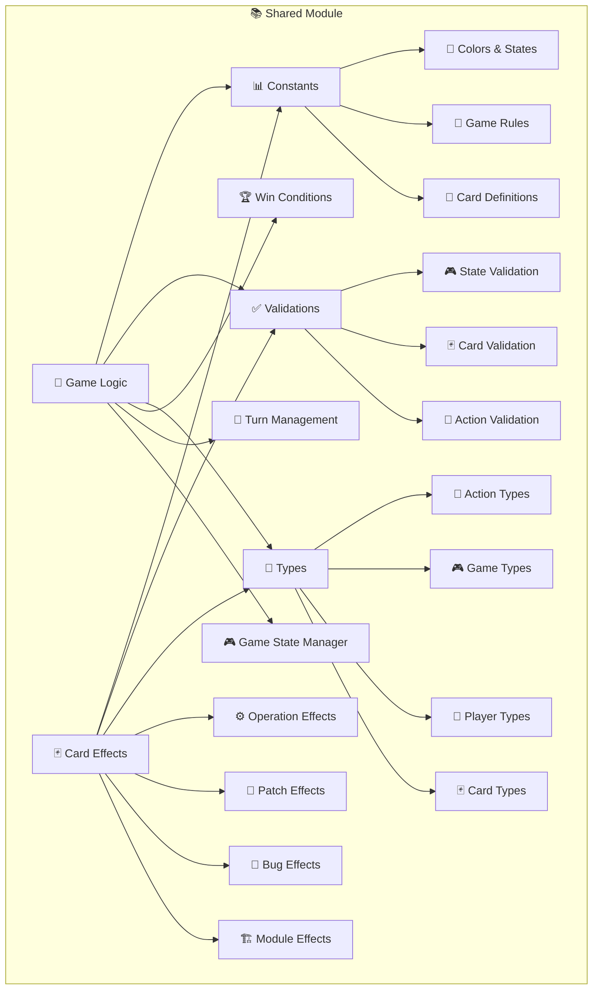

## 🔄 Flujo de Datos en Tiempo Real

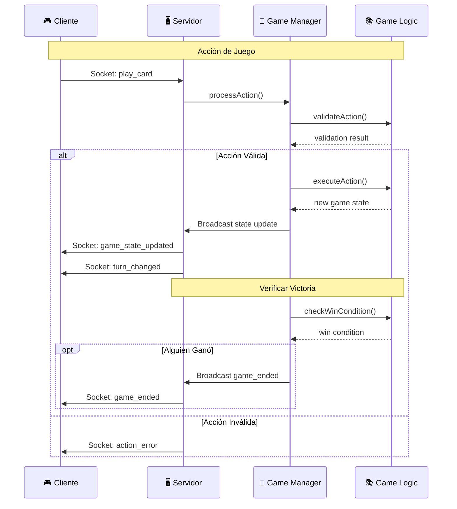

## 🎮 Lógica de Juego Core

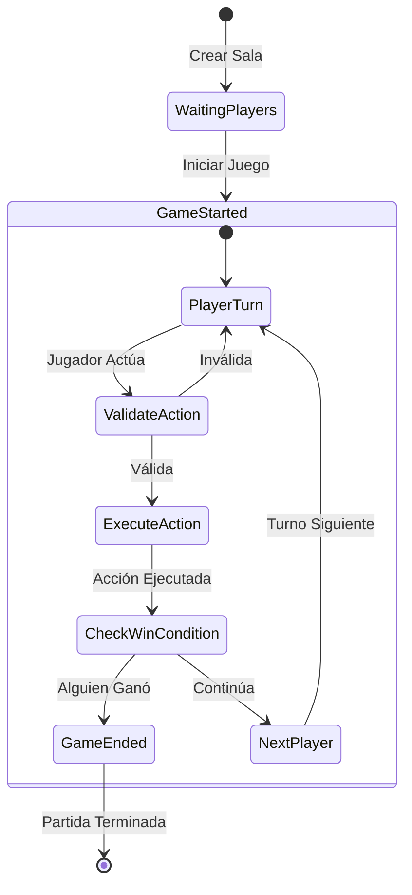

### 🃏 Sistema de Cartas

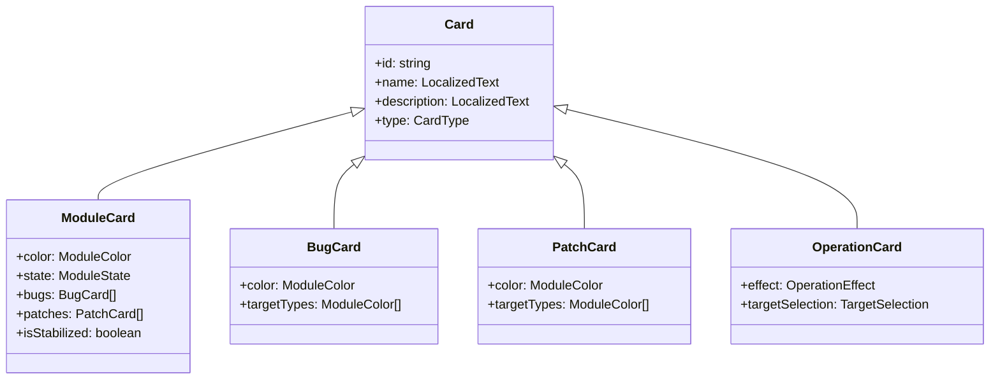

## 🔌 Eventos de WebSocket

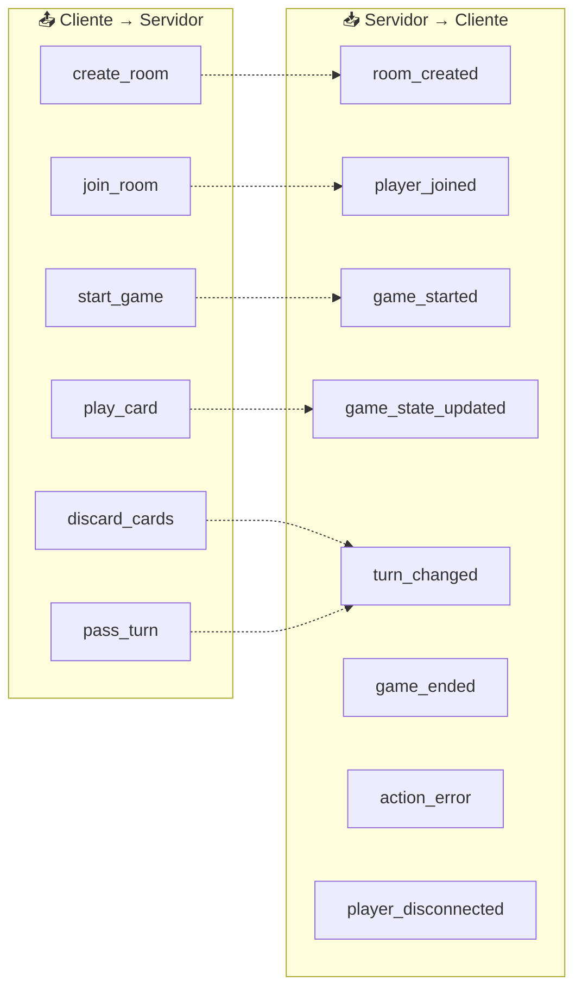

### 📡 Protocolo de Comunicación

| Evento               | Dirección | Datos                         | Descripción        |
| -------------------- | --------- | ----------------------------- | ------------------ |
| `create_room`        | C→S       | `{playerName, settings}`      | Crear nueva sala   |
| `join_room`          | C→S       | `{roomCode, playerName}`      | Unirse a sala      |
| `play_card`          | C→S       | `{card, target?, selection?}` | Jugar carta        |
| `game_state_updated` | S→C       | `GameState`                   | Estado actualizado |
| `turn_changed`       | S→C       | `{currentPlayer, actions}`    | Cambio de turno    |

## 🤖 Sistema de IA

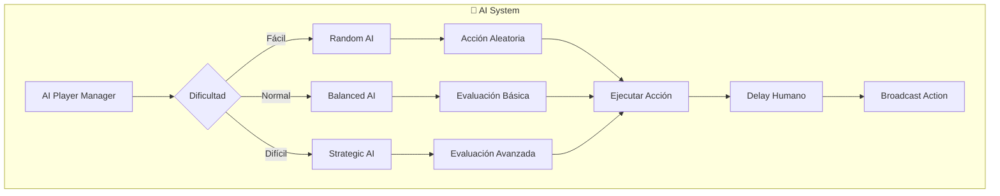

### 🎯 Estrategias de IA

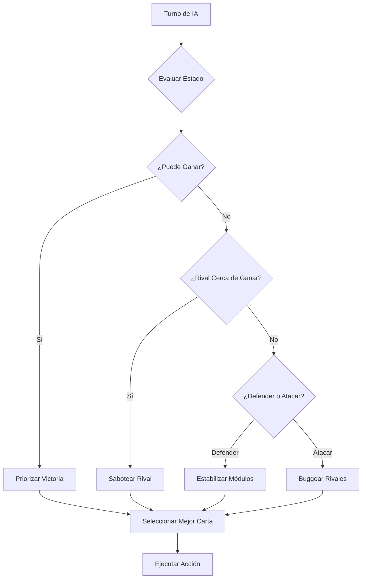

## 📱 Progressive Web App (PWA)

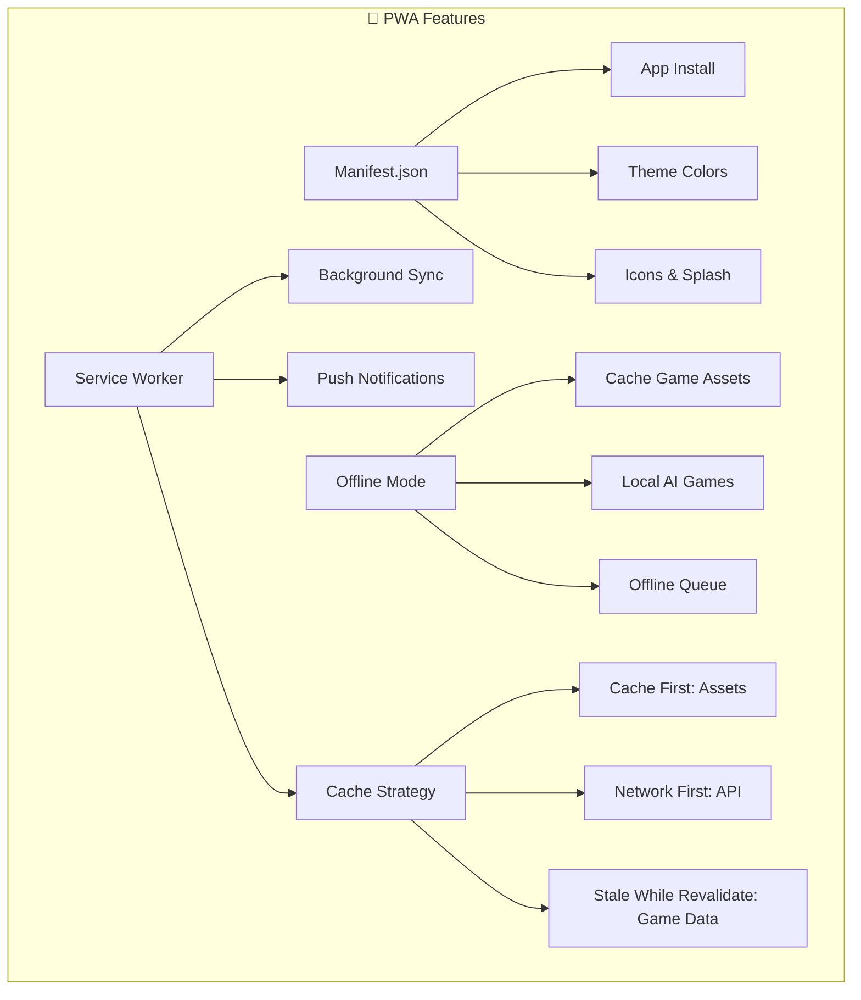

## 🌍 Internacionalización (i18n)

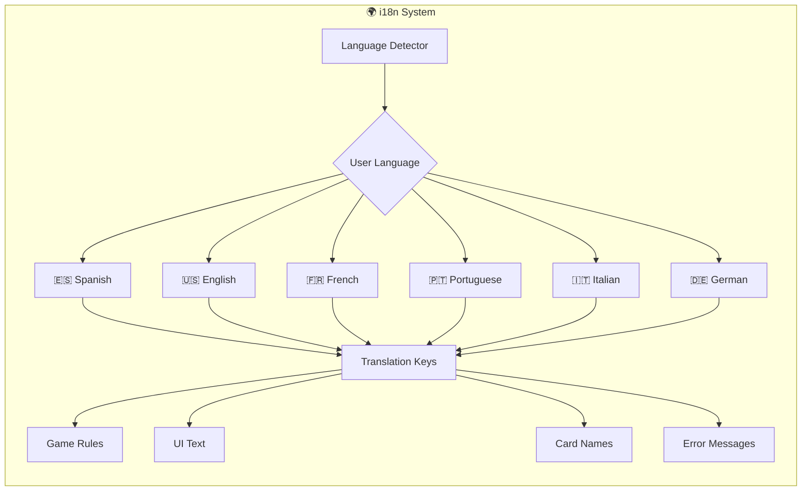

## 🧪 Testing Strategy

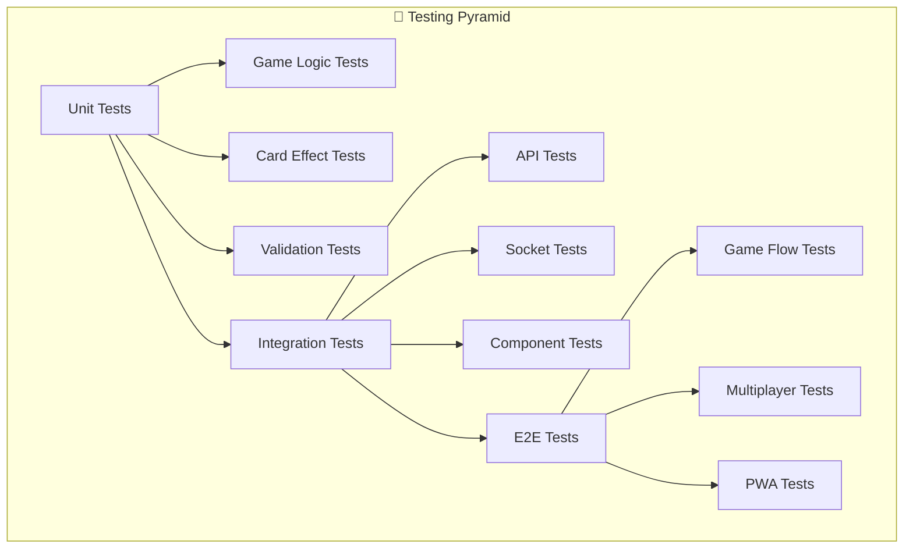

## 🚀 Despliegue y Escalabilidad

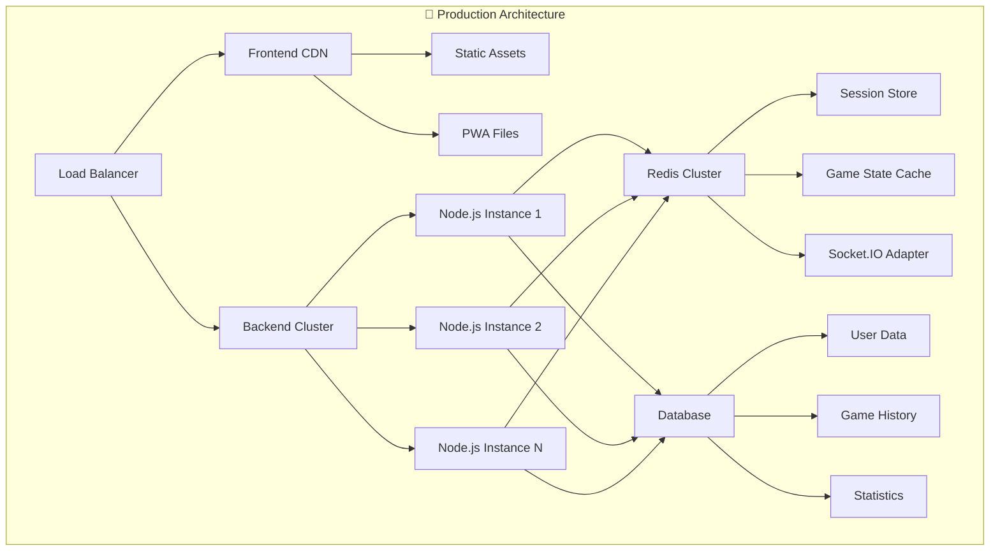

## 📊 Métricas y Monitoring

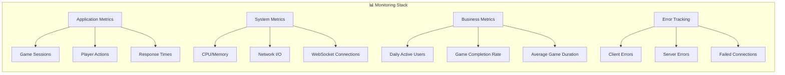

---

## 🔗 Referencias Técnicas

- **Framework Frontend**: [React 18](https://react.dev/)
- **Build Tool**: [Vite](https://vitejs.dev/)
- **Estado Global**: [Zustand](https://github.com/pmndrs/zustand)
- **Comunicación RT**: [Socket.IO](https://socket.io/)
- **Styling**: [TailwindCSS](https://tailwindcss.com/)
- **Animaciones**: [Framer Motion](https://www.framer.com/motion/)
- **Testing**: [Jest](https://jestjs.io/) + [React Testing Library](https://testing-library.com/)
- **PWA**: [Vite PWA Plugin](https://vite-pwa-org.netlify.app/)

**TeraDeck Team - Arquitectura Técnica** 🚀
