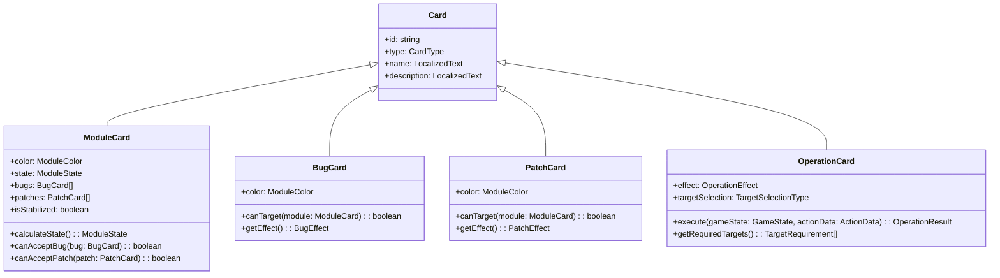

# 🎮 Lógica Interna del Juego TeraDeck

## 📋 Visión General

Este documento describe la implementación técnica de las reglas de TeraDeck, incluyendo algoritmos, estructuras de datos y flujos de validación utilizados en el sistema.

## 🏗️ Arquitectura de Componentes de Juego

```mermaid
graph TB
    subgraph "🎮 Game Engine Core"
        A[Game State Manager] --> B[Action Processor]
        B --> C[Validation Engine]
        C --> D[Card Effects Engine]
        D --> E[Turn Manager]
        E --> F[Win Condition Checker]

        A --> G[State Persistence]
        A --> H[Event Broadcasting]
    end

    subgraph "🃏 Card System"
        I[Card Factory] --> J[Module Cards]
        I --> K[Bug Cards]
        I --> L[Patch Cards]
        I --> M[Operation Cards]

        N[Effect Registry] --> O[Module Effects]
        N --> P[Bug Effects]
        N --> Q[Patch Effects]
        N --> R[Operation Effects]
    end

    subgraph "🤖 AI System"
        S[AI Manager] --> T[Strategy Engine]
        T --> U[Action Evaluator]
        U --> V[Decision Tree]
        V --> W[Action Executor]
    end

    B --> N
    D --> N
    E --> S
```



## 🎯 Estructura de Datos Core

### 🎮 Game State

```typescript
interface GameState {
  id: string;
  status: GameStatus;
  players: Player[];
  currentPlayerIndex: number;
  turn: number;
  deck: Card[];
  discardPile: Card[];
  settings: GameSettings;
  history: GameAction[];
  createdAt: Date;
  lastAction?: Date;
}
```

### 👥 Player State

```typescript
interface Player {
  id: string;
  name: string;
  isAI: boolean;
  aiDifficulty?: AIDifficulty;
  hand: Card[];
  modules: ModuleCard[];
  skippedTurns: number;
  score: number;
  isConnected: boolean;
  joinedAt: Date;
}
```

### 🃏 Card Hierarchy



## 🔄 Flujo de Procesamiento de Acciones


## 🃏 Sistema de Efectos de Cartas

### 🏗️ Module Card Effects

```typescript
class ModuleEffects {
  static placeModule(
    gameState: GameState,
    playerId: string,
    moduleCard: ModuleCard
  ): EffectResult {
    const player = this.getPlayer(gameState, playerId);

    // Validar no duplicados
    if (this.hasDuplicateModule(player, moduleCard)) {
      return EffectResult.error('errors.cannotPlaceDuplicate');
    }

    // Aplicar efecto
    const newModule = this.createFreshModule(moduleCard);
    player.modules.push(newModule);
    this.removeFromHand(player, moduleCard);

    return EffectResult.success({
      moduleAdded: newModule,
      handUpdated: player.hand,
    });
  }

  private static hasDuplicateModule(
    player: Player,
    moduleCard: ModuleCard
  ): boolean {
    return player.modules.some(
      existing =>
        existing.color === moduleCard.color &&
        moduleCard.color !== ModuleColor.MULTICOLOR
    );
  }
}
```

### 🐛 Bug Card Effects

```typescript
class BugEffects {
  static applyBug(
    gameState: GameState,
    playerId: string,
    bugCard: BugCard,
    targetData: TargetData
  ): EffectResult {
    const targetModule = this.getTargetModule(gameState, targetData);

    if (!this.validateBugApplication(bugCard, targetModule)) {
      return EffectResult.error('errors.invalidTarget');
    }

    const effect = this.determineBugEffect(targetModule, bugCard);
    return this.executeBugEffect(gameState, effect);
  }

  private static determineBugEffect(
    module: ModuleCard,
    bug: BugCard
  ): BugEffectType {
    if (module.isStabilized) {
      return BugEffectType.IMMUNE;
    }

    if (module.patches.length > 0) {
      return BugEffectType.DESTROY_PATCH;
    }

    if (module.bugs.length > 0) {
      return BugEffectType.COLLAPSE_MODULE;
    }

    return BugEffectType.BUG_MODULE;
  }

  private static executeBugEffect(
    gameState: GameState,
    effect: BugEffectType
  ): EffectResult {
    switch (effect) {
      case BugEffectType.BUG_MODULE:
        return this.bugModule(gameState);
      case BugEffectType.DESTROY_PATCH:
        return this.destroyPatch(gameState);
      case BugEffectType.COLLAPSE_MODULE:
        return this.collapseModule(gameState);
      case BugEffectType.IMMUNE:
        return EffectResult.error('errors.moduleAlreadyStable');
    }
  }
}
```

### 🔧 Patch Card Effects

```typescript
class PatchEffects {
  static applyPatch(
    gameState: GameState,
    playerId: string,
    patchCard: PatchCard,
    targetData: TargetData
  ): EffectResult {
    const targetModule = this.getTargetModule(gameState, targetData);

    if (!this.validatePatchApplication(patchCard, targetModule)) {
      return EffectResult.error('errors.invalidTarget');
    }

    const effect = this.determinePatchEffect(targetModule, patchCard);
    return this.executePatchEffect(gameState, effect);
  }

  private static determinePatchEffect(
    module: ModuleCard,
    patch: PatchCard
  ): PatchEffectType {
    if (module.bugs.length > 0) {
      return PatchEffectType.FIX_BUG;
    }

    if (module.patches.length >= 1) {
      return PatchEffectType.STABILIZE_MODULE;
    }

    return PatchEffectType.PROTECT_MODULE;
  }
}
```

## ⚙️ Sistema de Operaciones

### 🏗️ Cambio de Arquitecto


```typescript
class ArchitectChangeOperation {
  static execute(
    gameState: GameState,
    actionData: ArchitectChangeData
  ): OperationResult {
    const validation = this.validateSelection(gameState, actionData);
    if (!validation.isValid) {
      return OperationResult.error(validation.errorKey);
    }

    const { player1, module1, player2, module2 } =
      this.extractTargets(actionData);

    // Verificar que el intercambio no cause duplicados
    if (this.wouldCauseDuplicates(player1, player2, module1, module2)) {
      return OperationResult.error('errors.exchangeWouldCauseDuplicates');
    }

    // Ejecutar intercambio
    this.removeModuleFromPlayer(player1, module1);
    this.removeModuleFromPlayer(player2, module2);
    this.addModuleToPlayer(player1, module2);
    this.addModuleToPlayer(player2, module1);

    return OperationResult.success({
      exchangedModules: [module1, module2],
      affectedPlayers: [player1.id, player2.id],
    });
  }

  private static wouldCauseDuplicates(
    player1: Player,
    player2: Player,
    module1: ModuleCard,
    module2: ModuleCard
  ): boolean {
    const player1WouldHaveDuplicate = player1.modules
      .filter(m => m.id !== module1.id)
      .some(
        m =>
          m.color === module2.color && module2.color !== ModuleColor.MULTICOLOR
      );

    const player2WouldHaveDuplicate = player2.modules
      .filter(m => m.id !== module2.id)
      .some(
        m =>
          m.color === module1.color && module1.color !== ModuleColor.MULTICOLOR
      );

    return player1WouldHaveDuplicate || player2WouldHaveDuplicate;
  }
}
```

### 🎯 Reclutamiento del Groso


### 🎣 Phishing Interno

```typescript
class InternalPhishingOperation {
  static execute(gameState: GameState, playerId: string): OperationResult {
    const player = this.getPlayer(gameState, playerId);
    const buggedModules = this.getBuggedModules(player);

    if (buggedModules.length === 0) {
      return OperationResult.error('errors.noBugsToTransfer');
    }

    const transferResults: BugTransfer[] = [];

    // Procesar cada módulo buggeado
    for (const module of buggedModules) {
      for (const bug of module.bugs) {
        const target = this.findValidTarget(gameState, playerId, bug);

        if (target) {
          this.transferBug(module, bug, target.player, target.module);
          transferResults.push({
            bug,
            fromModule: module.id,
            toPlayer: target.player.id,
            toModule: target.module.id,
          });
        }
      }
    }

    return OperationResult.success({
      transferredBugs: transferResults,
      affectedPlayers: this.getAffectedPlayerIds(transferResults),
    });
  }

  private static findValidTarget(
    gameState: GameState,
    attackingPlayerId: string,
    bug: BugCard
  ): { player: Player; module: ModuleCard } | null {
    for (const player of gameState.players) {
      if (player.id === attackingPlayerId) continue;

      for (const module of player.modules) {
        if (this.canBugTransferToModule(bug, module)) {
          return { player, module };
        }
      }
    }

    return null;
  }

  private static canBugTransferToModule(
    bug: BugCard,
    module: ModuleCard
  ): boolean {
    return (
      module.state === ModuleState.FREE &&
      !module.isStabilized &&
      this.isColorCompatible(bug.color, module.color)
    );
  }
}
```

## 🌈 Sistema de Compatibilidad de Colores

```typescript
class ColorCompatibility {
  static isCompatible(
    cardColor: ModuleColor,
    moduleColor: ModuleColor
  ): boolean {
    // Multicolor es compatible con todo
    if (
      cardColor === ModuleColor.MULTICOLOR ||
      moduleColor === ModuleColor.MULTICOLOR
    ) {
      return true;
    }

    // Colores específicos solo con su match
    return cardColor === moduleColor;
  }

  static getCompatibleTargets(
    gameState: GameState,
    cardColor: ModuleColor,
    excludePlayerId?: string
  ): ModuleCard[] {
    const targets: ModuleCard[] = [];

    for (const player of gameState.players) {
      if (excludePlayerId && player.id === excludePlayerId) continue;

      for (const module of player.modules) {
        if (this.isCompatible(cardColor, module.color)) {
          targets.push(module);
        }
      }
    }

    return targets;
  }
}
```

## 🏆 Sistema de Validación de Victoria


```typescript
class WinConditionChecker {
  static checkWinCondition(gameState: GameState): WinCondition | null {
    for (const player of gameState.players) {
      const winCondition = this.checkPlayerWinCondition(player);
      if (winCondition.hasWon) {
        return {
          winnerId: player.id,
          winnerName: player.name,
          stableModules: winCondition.stableModules,
          winType: 'standard',
          timestamp: new Date(),
        };
      }
    }

    return null;
  }

  static checkPlayerWinCondition(player: Player): PlayerWinCondition {
    const stableModules = this.getStableModules(player);
    const hasWon = stableModules.length >= 4;

    return {
      playerId: player.id,
      hasWon,
      stableModules,
      moduleCount: stableModules.length,
      totalModules: player.modules.length,
    };
  }

  private static getStableModules(player: Player): ModuleCard[] {
    return player.modules.filter(module => this.isModuleStable(module));
  }

  private static isModuleStable(module: ModuleCard): boolean {
    // Un módulo es estable si no tiene bugs
    return module.bugs.length === 0;
  }

  static getModuleStability(module: ModuleCard): ModuleStability {
    if (module.isStabilized) {
      return ModuleStability.STABILIZED;
    }

    if (module.bugs.length > 0) {
      return ModuleStability.BUGGED;
    }

    if (module.patches.length > 0) {
      return ModuleStability.PATCHED;
    }

    return ModuleStability.FREE;
  }
}
```

## 🤖 Sistema de Inteligencia Artificial

### 🎯 AI Decision Engine


```typescript
class AIDecisionEngine {
  constructor(private difficulty: AIDifficulty) {}

  async decideAction(
    gameState: GameState,
    aiPlayer: Player
  ): Promise<GameAction> {
    await this.addHumanLikeDelay();

    const analysis = this.analyzeGameState(gameState, aiPlayer);
    const strategy = this.selectStrategy(analysis);

    return this.executeStrategy(strategy, gameState, aiPlayer);
  }

  private analyzeGameState(
    gameState: GameState,
    aiPlayer: Player
  ): GameAnalysis {
    return {
      canWinThisTurn: this.checkImmediateWin(aiPlayer),
      opponentsCloseToWin: this.checkOpponentThreats(gameState, aiPlayer),
      boardPosition: this.evaluateBoardPosition(gameState, aiPlayer),
      availableActions: this.getValidActions(gameState, aiPlayer),
      threatLevel: this.calculateThreatLevel(gameState, aiPlayer),
    };
  }

  private selectStrategy(analysis: GameAnalysis): AIStrategy {
    if (analysis.canWinThisTurn) {
      return AIStrategy.IMMEDIATE_WIN;
    }

    if (analysis.opponentsCloseToWin.length > 0) {
      return AIStrategy.SABOTAGE;
    }

    switch (this.difficulty) {
      case AIDifficulty.EASY:
        return AIStrategy.RANDOM;
      case AIDifficulty.NORMAL:
        return this.selectBalancedStrategy(analysis);
      case AIDifficulty.HARD:
        return this.selectOptimalStrategy(analysis);
    }
  }

  private async addHumanLikeDelay(): Promise<void> {
    const delayMs = this.calculateHumanDelay();
    await new Promise(resolve => setTimeout(resolve, delayMs));
  }

  private calculateHumanDelay(): number {
    const baseDelay = 1000; // 1 second base
    const randomFactor = Math.random() * 2000; // 0-2 seconds random
    const difficultyFactor = this.difficulty === AIDifficulty.HARD ? 1000 : 0;

    return baseDelay + randomFactor + difficultyFactor;
  }
}
```

### 🎯 AI Strategy Implementations

```typescript
class AIStrategies {
  static executeImmediateWin(
    gameState: GameState,
    aiPlayer: Player
  ): GameAction {
    // Buscar la carta que completa la victoria
    const winningCard = aiPlayer.hand.find(card =>
      this.wouldWinWithCard(gameState, aiPlayer, card)
    );

    if (winningCard?.type === CardType.MODULE) {
      return this.createPlayCardAction(aiPlayer.id, winningCard);
    }

    // Si es una operación o carta que libera un módulo buggeado
    return this.createOptimalAction(gameState, aiPlayer, winningCard);
  }

  static executeSabotageStrategy(
    gameState: GameState,
    aiPlayer: Player,
    threats: Player[]
  ): GameAction {
    const primaryThreat = threats[0];
    const sabotageCard = this.findBestSabotageCard(
      aiPlayer.hand,
      primaryThreat
    );

    if (sabotageCard) {
      return this.createSabotageAction(
        aiPlayer.id,
        sabotageCard,
        primaryThreat
      );
    }

    // Si no puede sabotear, jugar defensivamente
    return this.executeDefensiveStrategy(gameState, aiPlayer);
  }

  static executeBalancedStrategy(
    gameState: GameState,
    aiPlayer: Player
  ): GameAction {
    const actions = this.evaluateAllPossibleActions(gameState, aiPlayer);
    const scoredActions = actions.map(action => ({
      action,
      score: this.scoreAction(gameState, aiPlayer, action),
    }));

    scoredActions.sort((a, b) => b.score - a.score);
    return scoredActions[0]?.action || this.createPassAction(aiPlayer.id);
  }

  private static scoreAction(
    gameState: GameState,
    aiPlayer: Player,
    action: GameAction
  ): number {
    let score = 0;

    // Puntaje por progreso hacia victoria
    score += this.calculateProgressScore(aiPlayer, action) * 10;

    // Puntaje por obstaculizar oponentes
    score += this.calculateSabotageScore(gameState, action) * 8;

    // Puntaje por defensa
    score += this.calculateDefenseScore(aiPlayer, action) * 6;

    // Puntaje por eficiencia de cartas
    score += this.calculateCardEfficiencyScore(action) * 4;

    return score;
  }
}
```

## 📊 Métricas y Analytics del Juego

```typescript
class GameAnalytics {
  static trackGameEvent(gameState: GameState, event: GameEvent): void {
    const metrics = {
      gameId: gameState.id,
      turn: gameState.turn,
      playerCount: gameState.players.length,
      aiPlayerCount: gameState.players.filter(p => p.isAI).length,
      event: event.type,
      timestamp: new Date(),
      gameState: this.serializeGameState(gameState),
    };

    this.persistMetrics(metrics);
  }

  static generateGameSummary(gameState: GameState): GameSummary {
    return {
      duration: this.calculateGameDuration(gameState),
      totalTurns: gameState.turn,
      winner: this.getWinner(gameState),
      finalScores: this.calculateFinalScores(gameState),
      keyMoments: this.identifyKeyMoments(gameState),
      playerStats: this.generatePlayerStats(gameState),
    };
  }

  private static identifyKeyMoments(gameState: GameState): GameMoment[] {
    return gameState.history
      .filter(action => this.isSignificantAction(action))
      .map(action => this.createGameMoment(action));
  }

  private static isSignificantAction(action: GameAction): boolean {
    return (
      [
        ActionType.PLAY_CARD,
        // Filtrar por cartas de operación específicas
      ].includes(action.type) && this.hasHighImpact(action)
    );
  }
}
```

---

## 🔧 Herramientas de Debug

```typescript
class GameDebugger {
  static validateGameState(gameState: GameState): ValidationReport {
    const errors: string[] = [];
    const warnings: string[] = [];

    // Validar integridad de cartas
    this.validateCardIntegrity(gameState, errors);

    // Validar estados de módulos
    this.validateModuleStates(gameState, errors);

    // Validar turnos
    this.validateTurnLogic(gameState, warnings);

    return { errors, warnings, isValid: errors.length === 0 };
  }

  static exportGameState(gameState: GameState): string {
    return JSON.stringify(gameState, null, 2);
  }

  static importGameState(json: string): GameState {
    const state = JSON.parse(json);
    return this.reconstructGameState(state);
  }
}
```

---

**Esta documentación técnica proporciona una visión completa de la implementación interna del juego TeraDeck, facilitando el mantenimiento, debugging y futuras extensiones del sistema.** 🎮

**TeraDeck Engineering Team** ⚙️🎯
